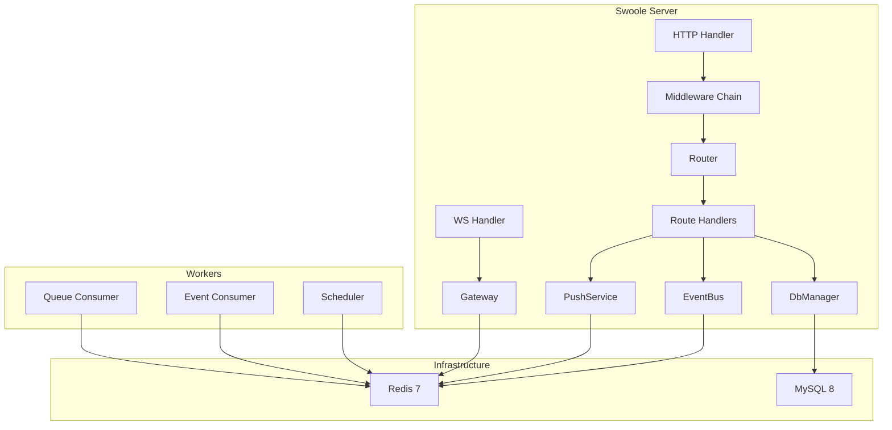

# SwooleFabric — System Architecture

## Overview

SwooleFabric is a unified Swoole runtime that consolidates:
- **HTTP API server** (REST endpoints)
- **WebSocket gateway** (realtime push/presence)
- **Queue workers** (Redis Streams)
- **Event consumers** (publish/subscribe with dedupe)

into a single deployable process.

## Component Diagram



## Data Flow: Send Message

```
1. HTTP POST /api/rooms/{id}/messages
   → AuthMiddleware → TenancyMiddleware → Handler
2. Handler persists message (MySQL, tenant_id enforced)
3. Handler emits MessageSent event (Redis Stream)
4. Handler calls PushService.pushRoom() (Redis PUBLISH)
5. Gateway workers receive pub/sub → push to local WS fds
6. Event consumer reads MessageSent → updates projections
```

## Tenancy Enforcement

Every execution path requires TenantContext:

| Path | Where tenant is set |
|------|-------------------|
| HTTP | TenancyMiddleware (host/header/JWT) |
| WebSocket | WsAuthHandler (JWT token) |
| Queue Job | Context restored from job fields |
| Event Consumer | Context restored from event fields |

## Long-Running Safety

| Rule | Implementation |
|------|---------------|
| No global mutable state | `Context::reset()` per request |
| No stored connections | Borrow → use → release in same coroutine |
| Per-worker pools | Initialized in `onWorkerStart` |
| Health checks | `SELECT 1` on every pool borrow |
| Bounded pools | `ConnectionPool` with `max_size` via Channel |
