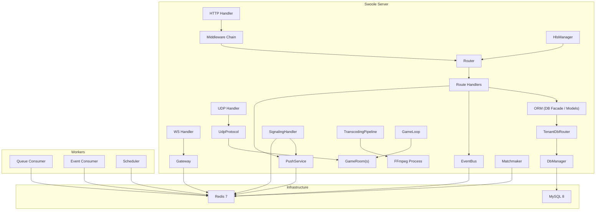

# Fabriq — System Architecture

## Overview

Fabriq is a unified Swoole runtime that consolidates:
- **HTTP API server** (REST endpoints)
- **WebSocket gateway** (realtime push/presence)
- **Queue processor** (Redis Streams)
- **Event consumers** (publish/subscribe with dedupe)
- **Live streaming** (WebRTC signaling, FFmpeg RTMP→HLS transcoding, viewer tracking, chat moderation)
- **Game server** (fixed tick-rate game loop, UDP protocol with MessagePack, Redis ZSET matchmaking, lobbies, delta state sync)
- **ORM** (Active Record models, fluent query builder, stored procedure calls, per-tenant database routing, schema migrations)

into a single deployable process.

## Component Diagram



## Data Flow: Send Message

```
1. HTTP POST /api/rooms/{id}/messages
   → AuthMiddleware → TenancyMiddleware → Handler
2. Handler persists message via ORM (Model::create() or DB::table())
   → TenantDbRouter resolves tenant database strategy (shared / same_server / dedicated)
   → Connection borrowed from correct pool → query executed → connection released
3. Handler emits MessageSent event (Redis Stream)
4. Handler calls PushService.pushRoom() (Redis PUBLISH)
5. Gateway workers receive pub/sub → push to local WS fds
6. Event consumer reads MessageSent → updates projections
```

## ORM & Database Routing

The ORM layer sits between application code and the database:

```
Application Code → DB Facade / Model → QueryBuilder → TenantDbRouter → DbManager → MySQL
                                     → ProcedureCall → TenantDbRouter → DbManager → MySQL
```

The `TenantDbRouter` dynamically selects the database strategy per tenant:

| Strategy | How It Works |
|----------|-------------|
| `shared` | All tenants share the `app` pool. Isolation via `WHERE tenant_id = ?` |
| `same_server` | Borrow from `app` pool, then `USE <tenant_db>`. Restore on release |
| `dedicated` | Dynamically create/cache a `ConnectionPool` for the tenant's MySQL server (LRU eviction) |

## Tenancy Enforcement

Every execution path requires TenantContext:

| Path | Where tenant is set |
|------|-------------------|
| HTTP | TenancyMiddleware (host/header/JWT) |
| WebSocket | WsAuthHandler (JWT token) |
| Queue Job | Context restored from job fields |
| Event Consumer | Context restored from event fields |
| Live Streaming | StreamManager carries `tenant_id`; signaling/chat messages are tenant-scoped |
| Game Server | GameRoom and Matchmaker carry `tenant_id`; UDP packets include room context |
| ORM Models | `HasTenantScope` trait auto-injects `tenant_id` in all queries and inserts |
| Stored Procedures | `ProcedureCall` routes through `TenantDbRouter` to correct tenant DB |

## Long-Running Safety

| Rule | Implementation |
|------|---------------|
| No global mutable state | `Context::reset()` per request |
| No stored connections | Borrow → use → release in same coroutine |
| Immutable query builder | Each `QueryBuilder` method returns a new instance (safe across coroutines) |
| Per-worker pools | Initialized in `onWorkerStart` |
| Health checks | `SELECT 1` on every pool borrow |
| Bounded pools | `ConnectionPool` with `max_size` via Channel |
| LRU eviction | Dedicated tenant pools are evicted when exceeding `max_dedicated_pools` |
